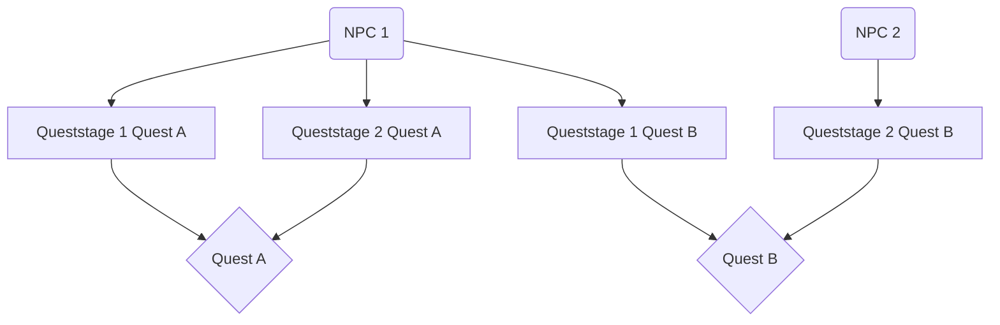

# MythicalQuests-v2.0
> [!important]
> This Datapack is made for Minecraft Version 1.20.2 upto 1.20.4

# Downloads

Download|Description
---|---
MythicalQuests_v2.0| All the features of the datapack.
MythicalQuests_v2.0_trimmed| Meant to be used after all content is created. Packs the bare minimum to make already made content function.
<br/>
<br/>
<br/>
<br/>

# Introduction
* A few general pointers to get you oriented with how the datapack organises stuff and introduction to terminology.
* The Details of how to actually use the pack will be mentioned later.
* Please make sure to read this before proceeding!
<br/>
<br/>
  
## Queststages

* Queststages are a part of a Quest that a single NPC has. Each Queststage is uniquely identified by a Queststage Name and a Quest Name.
* Queststages with the same Quest Name are considered part of the same Quest.
* A Queststage holds it's own name, the name of it's associated Quest, along with a Script.
* Additionally the Queststage can have requirements to trigger it (Progress in other Quests, or certain command checks) as well as a blacklist (Progress in other Quests, or certain command checks)
> [!NOTE]
> There can only be one Queststage with a given Quest and Queststage Name. If a Queststage sharing this is added, the previous one is overwritten.


<br/>
<br/>

## NPCs


>[!Important]
> * In this datapack, NPCs are actually interactions. The Visual Model for the NPCs needs to be set by you.
> * The Villager is the Visual Model. The visible name is also on the Villager.
* NPCs are interacted with via Right Clicking Them.
* NPCs hold Queststages.
>[!Caution]
>Do not /kill NPCs. They have associated data that needs to be cleared to fully remove them. Use the Datapack Provided method for deleting NPCs.
<br/>
<br/>

## Quest Progress
* Quest Progress is an assignable stat for a Quest that can be awarded to a player.
* This is the recommended way to keep track of a player's progression.
* Quest Progress may or may not be awarded within a script, or externally.
* Quest Progress is also used to assign Objectives within the Questbook.
<br/>
<br/>
<br/>
<br/>

# Settings

* A few important settings to help customize Mythical Quests to your liking.
* They are stored on the scoreboard ``myquest.settings``
* Change them using:
  ```mcfunction
  scoreboard players set $<setting> myquest.settings <number>
  
  ##<number>
  #1 --> true
  #0 --> false
  ```


  ``<setting>``| Function| Default State
  ---|---|---
  $dialogueno|Adds numbering to NPC dialogue, showing current dialogue number and Total no. of Dialogues in the Script|True
  $spacer|Adds a line gap between NPC Dialogue automatically, making it more readable|True
  $fastforward|Skips Waiting times set between NPC Dialogue or other elements when NPC is Right Clicked Again|False

# Tools
* To get started using the pack, run the following command:
  ```mcfunction
  function myquest:api/tools
  ```
* You will get the Tools Item. This lets you access all the features of the pack.
  

# The Editor
  

* The Editor Lets you Generate Queststages and All components within it.
* To summon the Editor, Open the Tools book and click on ``[Summon Editor]``
* Look at the description of the Tools book. You can close the Editor using the instructions there.
* Once closed, you will lose all work on the closed editor.
* You can summon as many editors as you please.

