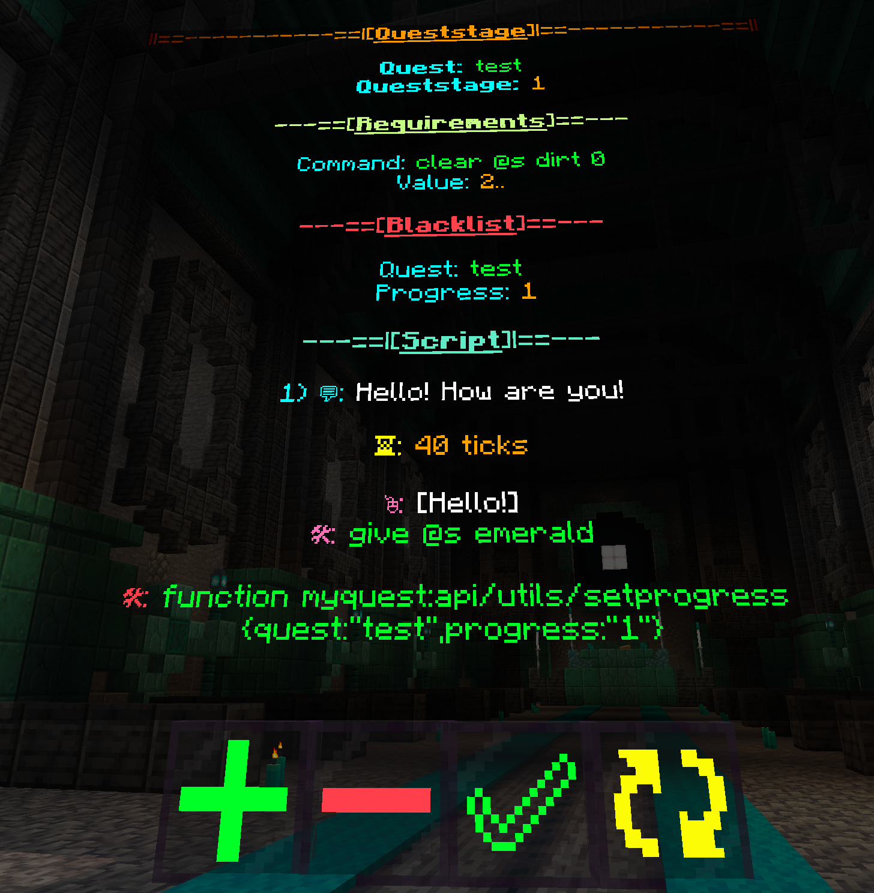

> [!caution]
>* This Datapack has two major versions, one for 1.20.2-1.20.4 and one for 1.20.5+
>* The Latest Releases have the full pack for their respective Minecraft Versions.

> [!important]
>* You may additionally download trimmed versions of these datapacks AFTER you have created everything you want with the pack. Trimmed versions keep the bare minimum required for already made content to work.
>* Trimmed versions can be found above in the downloads folder.

<br/>
<br/>
<br/>
<br/>

# Introduction
* A few general pointers to get you oriented with how the datapack organises stuff and introduction to terminology.
* The Details of how to actually use the pack will be mentioned later.
* Please make sure to read this before proceeding!
<br/>
<br/>
  
## Queststages

* Queststages are a part of a Quest that a single NPC has. Each Queststage is uniquely identified by a Queststage Name and a Quest Name.
* Queststages with the same Quest Name are considered part of the same Quest.
* A Queststage holds it's own name, the name of it's associated Quest, along with a Script.
* Additionally the Queststage can have requirements to trigger it (Progress in other Quests, or certain command checks) as well as a blacklist (Progress in other Quests, or certain command checks)
> [!warning]
> There can only be one Queststage with a given Quest and Queststage Name. If a Queststage sharing this is added, the previous one is overwritten.


<br/>
<br/>

## NPCs


>[!Important]
> * In this datapack, NPCs are actually interactions. The Visual Model for the NPCs needs to be set by you.
> * The Villager is the Visual Model. The visible name is also on the Villager.
* NPCs are interacted with via Right Clicking Them.
* NPCs hold Queststages.
>[!warning]
>Do not /kill NPCs. They have associated data that needs to be cleared to fully remove them. Use the Datapack Provided method for deleting NPCs.
<br/>
<br/>

## Quest Progress
* Quest Progress is an assignable stat for a Quest that can be awarded to a player.
* This is the recommended way to keep track of a player's progression.
* Quest Progress may or may not be awarded within a script, or externally.
* Quest Progress is also used to assign Objectives within the Questbook.
<br/>
<br/>
<br/>
<br/>

# Settings

* A few important settings to help customize Mythical Quests to your liking.
* Can be accessed from within the Tools Book.
* Give yourself a Tools book by running the following command:
```mcfunction
function myquest:api/tools
```
* Open the book and Click on the ``[Pack Settings]`` button to configure settings.

* You can set a Prefix and Suffix (Prefix is right before NPC name in a dialogue, Suffix is right after).
* By Default Prefix is set to ``'{"text":"[","color":"gray"}'`` and suffix is set to ``'{"text":"]: ","color":"gray"}'``
* You can change this by running the command
```mcfunction
data modify storage myquest:api prefix set value '{"text":"whatever you want"}'  
data modify storage myquest:api suffix set value '{"text":"whatever you want"}'
```  
  
  <br/>
  <br/>
  <br/>
  <br/>

# Useful Commands
  ### Set a Player's Quest Progress in a Quest
   Run as the intended Player.
  ```mcfunction
  function myquest:api/utils/setprogress {quest:"<QUEST NAME>",progress:"<PROGRESS>"}
  ###Example
  #function myquest:api/utils/setprogress {quest:"Adventure Time",progress:"2"}
  ```

   ### Delete a Player's Quest Progress in a Quest
  Run as the intended Player.
  ```mcfunction
  function myquest:api/utils/deleteprogress {quest:"<QUEST NAME>"}
  ###Example
  #function myquest:api/utils/deleteprogress {quest:"Adventure Time"}
  ```

  ### Check a Player's Quest Progress in a Quest
  This is for external checking (Within other Datapacks/Command Blocks), within the pack there are better ways of checking Quest Progress. Run as the intended Player.
  ```mcfunction
  function myquest:api/utils/checkprogress {quest:"<QUEST NAME>",progress:"<PROGRESS>"}
  ###Example
  #function myquest:api/utils/checkprogress {quest:"Adventure Time",progress:"2"}
  # If Player has the appropriate progress, then
  ## $match on scoreboard myquest.zprivate will be = 1
  #
  ##Special Values
  #For Checking Progress, the value "any" will return true if any progress is present, besides progress "none"
  #Example
  #function myquest:api/utils/checkprogress {quest:"Adventure Time",progress:"any"}
  #This is will return true for ANY progress the player has within the Quest "Adventure Time" BESIDES "none"
  ```
  ### Change the Speaker in a Script
  Changes the displayed NPC name in dialogue, without any changes to the actual NPC. To be used within the Script
  ```mcfunction
  function myquest:api/utils/speaker {speaker:'<JSON TEXT>'}
  ##Example
  #function myquest:api/utils/speaker {speaker:'{"text":"John"}'}
  #This will change the speaker within the Script to John
  ```

  ### Force start a Queststage
  This ignores the Blacklist and Requirements of a Queststage, forcefully starting it. Run as the intended Player.
  ```mcfunction
  function myquest:api/utils/setprogress {quest:"<QUEST NAME>",progress:"<PROGRESS>"}
  ###Example
  #function myquest:api/utils/setprogress {quest:"Adventure Time",progress:"2"}
  ```

<br/>
<br/>
<br/>
<br/>

# Tools
* To get started using the pack, run the following command:
  ```mcfunction
  function myquest:api/tools
  ```
* You will get the Tools Item. This lets you access all the features of the pack.
  
  
  <br/>
  <br/>
  <br/>
  <br/>

# The Editor
  

* The Editor Lets you Generate Queststages and All components within it.
* To summon the Editor, Open the Tools book and click on ``[Summon Editor]``
* Look at the description of the Tools book. You can close the Editor using the instructions there.
>[!warning]
>If you close the Editor, you will lose all work within the closed editor.

>[!tip]
>You can summon multiple Editors.
<br/>
<br/>

  ## Buttons
  * The Editor has 4 buttons:

  Button|Function
  ---|---
  ``[+]``|Adds an element to the **bottom** of the list upon Right Clicking. Shift Right Click to open a more detailed menu to add/replace elements elsewhere.
  ``[-]``|Removes the **bottom-most** element of the list upon Right Clicking. Shift Right Click to open a more detailed menu to remove elements elsewhere.
  ``[✅]``| Generates the component of the Queststage in the form of an item, if everything necessary is present. When the Editor is in Script or Queststage mode, Right Click holding the tools book to Preview the Script or the Queststage (Matches Requirements and Blacklist for Queststage preview)
  ``[↻]``|Cycles between Editor modes. Sneak Right Click while holding Tools book to close editor.
  <br/>
  <br/>

  ## Script Mode
  >[!important]
  > This is a necessary component of a Queststage

  
  

  A Script can have 4 Types of Inputs:
  Input|Method of Input|Example
  ---|---|---
  Dialogue(💬)|Makes the NPC say something in chat. Type a tellraw command (with @p selector) into an **Impulse Command Block**, and Ctrl + Middle click to Grab it with NBT Data. Then add it to the ``[+]`` button on the Editor.|Command Block with command ``tellraw @p "Hello! How are you!"``
  Wait Time(⏳)|Waits the specified duration in ticks before continuing to read the Script. in a Book and Quil, write only a number, then add to the ``[+]`` button.|Book and Quil with ``40``on the first page
  Command(🛠)|Runs a command as the Player, at the Player. Type the Command in a **Chain Command Block** and add it to the ``[+]`` Button.|Chain Command Block with ``function myquest:api/utils/setprogress {quest:"test",progress:"1"}``
  Click Event(🖱️)|Generates a Clickable Text for the Player, which can be clicked. It may run commands on click if specified. Script reading stops when a Click Event is reached, and waits for a response. If Multiple Click Events are in a row in a Script, All of them are displayed before the Script stops and waits for a response. Method of Creation mentioned later in it's own secton|Click Event saying ``[Hello!]``, which runs the command ``give @s emerald``
  
  >[!warning]
  > When adding Commands to be run, do not add a ``/`` in front of them.
  <br/>
  <br/>

  ## Click Event Mode
  
  
  * Click Events are added within the Script.
  * The Player Can Click these in Chat to give a reply.
  * You can set commands to run when the Click Event is clicked.
  * A Click Event can have two Inputs:

  Input|Method of Input|Example
  ---|---|---
  Clickable Text(🖱️)|The text the Player is Supposed to click. Add in the same way as Dialogue in Script Mode.|Command Block with ``tellraw @p "[Hello!]"``
  Command(🛠)|Runs a list of commands in order when Click event is Clicked. Add in the same way as Command in Script Mode. You can add multiple commands.|Chain Command Block with ``give @s emerald``

  * After Adding the Appropriate elements to your Click Event, generate it into an item by clicking on the ``[✅]`` button. You can now add this item to the Script Mode ``[+]`` button to add it to a script.
    
  >[!warning]
  > When adding Commands to be run, do not add a ``/`` in front of them.
    
  >[!tip]
  >Add Brackets such as ``[]`` to the Clickable Text, or give it a unique color to indicate to the Player that this text is clickable.

  >[!important]
  >Using a ``{"selector":"@s"}``, especially in Click Event Text is very annoying due to it's inherent click event of whispering to the player, which prevents Clicking it. Instead of ``{"selector":"@s"}``, please use ``{"nbt":"name","storage":"myquest:api"}`` instead, as it will have the same effect, minus the annoying part.
  <br/>
  <br/>
  

  ## Requirements Mode and Blacklist Mode
  >[!Note]
  > Optional, but recommended components for Queststages
  

  * If the Blacklist is met, Queststage does not trigger.
  * If the Requirements are not met, Queststage does not trigger.
  * There are two types of input in both Requirements and Blacklist:

  Input|Method of Input|Example
  ---|---|---
  Command|Runs a command as the Player, at The player and compares the result of the command to a value. Hold Chain Command Block with Command in mainhand and Book and Quil with value in     Offhand. Values can be ``x.. (x or greater)``, ``..x (x or lesser)`` or ``x..y (Between x and y, including x and y)``|Chain Command Block with ``clear @s dirt 0``, Book and Quil with        ``2..`` Will check if the player has at least 2 dirt.
  Quest Progress|Checks if the player has the specified Progress in the specified Quest. In a Book and Quil, write in the following format: ``quest:"QUEST NAME",progress:"PROGRESS"``|Book and Quil with ``quest:"test",progress:"1"``

  * After Making the Requirements and Blacklist in the Editor, grab them by clicking on the ``[✅]`` button.

  >[!warning]
  > When adding Commands to be run, do not add a ``/`` in front of them.

  <br/>
  <br/>

  ## Queststage Mode
  >[!Important]
  >* A Queststage Must have a Script, Queststage Name and a Quest Name
  >* Queststages are grouped according to Quest Names in Menus, so be consistent.
  
  >[!WARNING]
  >There can only be one Queststage with a given Quest and Queststage Name. If a Queststage sharing this is added, the previous one is overwritten.
  
  
  The Queststage Mode has 4 types of inputs:

  Input|Method of Input|Example
  ---|---|---
  Script|Add the Script by holding it in your hand and pressing the ``[+]`` button.|The Script generated in the Script Mode Example.
  Requirements|Add the Requirements by holding it in your hand and pressing the ``[+]`` button.|The Requirements generated in the Requirements and Blacklist Mode Example.
  Blacklist|Add the Blacklist by holding it in your hand and pressing the ``[+]`` button.|The Blacklist generated in the Requirements and Blacklist Mode Example.
  Quest Name and Queststage Name|In a Book and Quil, write in the following format: ``quest:"QUEST NAME",queststage:"QUESTSTAGE NAME"``|A Book and Quil with ``quest:"test",queststage:"1"``

  You can generate the Queststage in an Item form after inputting all necessary components and clicking the ``✅]`` button.
  <br/>
  <br/>
  <br/>
  <br/>

# NPCs
* You now need to create a NPC to assign the Queststage to.
* Open the Tools Book, select ``[NPCs Menu]``
* Click on ``[Create a New NPC]``
* Stand in the middle of the model you want, and follow the instructions (Press ``[Click Me!]`` first to get the command template pasted in your chat)
* To add a Queststage to the newly created NPC, simply hold the queststage and Right Click the NPC.
* You can Right Click an NPC while holding the Tools book to change it's settings. All options have text explaning them further, so you can click on them to see what they can do.
>[!note]
>If you want to modify the Height or Width of the interaction, you may use ``/data modify`` to do it.

>[!tip]
>* You can Browse through all NPCs that have been created through ``[Browse through NPCs]`` in the ``[NPCs]`` Menu.
>* You can also search for NPCs according to the Quests they have, using the ``[Search for NPCs]`` option. (A NPC mcan have multiple queststages from different Quests, don't worry!)

>[!tip]
>* You can browse through all Quests (Quests are created automatically when a Queststage is added to an NPC) through the ``[Browse through Quests]`` option under the ``[Quests Menu]``
>* You can see a Specific Quest's Queststages using the ``[See a Quest's Queststages]`` option.

* You can delete a NPC by opening it's settings and clicking on ``[Delete this NPC]``. It will warn you. It will also delete all Queststages assigned to the NPC, so take them out before deleting the NPC.
* You can take Queststages out of an NPC by Opening it's Settings (Right Click it with the Tools Book) and select ``[See this NPC's Queststages]``. There, click on the ``[-]`` button in front of the Queststage to take it out.


<br/>
<br/>
<br/>
<br/>

# Players
* Open the ``[Players Menu]`` within the Tools Book.
* Here you can browse through all registered Players and see their progress, or see a specific Player's progress via their username.
<br/>
<br/>
<br/>
<br/>

# The Questbook
* To give yourself or the Player a Questbook, run the following function
  ```mcfunction
  function myquest:api/questbook
  ```
* The Questbook is divided into 3 sections:
  
  * ``[Available Quests]``: Quests that can be started by the Player
  * ``[Ongoing Quests]``: Quests the Player has started
  * ``[Completed Quests]``: Quests the Player has completed
 
* You can assign Objectives to Quests, which are linked to Quest Progress, **not queststages**, and they appear within the Questbook.
* An Objective has 3 necessary parts:

Part|Description
---|---
Quest Name|The Quest under which the Objective appears
Quest Progress| The Progress under which that Objective Appears for the Specifed Quest
Objective| The actual Objective

* When an Objective is added, it will appear in the Player's Questbook automatically if they have the corresponding Quest Progress awarded to them.
<br/>
<br/>

  ## Adding Quest Objectives
  * Open the Tools book and selected ``[Quests Menu]``
  * Select ``[Manage a Quest's Objectives]``
  * Enter the name of the Quest you want to Add/Remove Objectives for. Example: ``{quest:"test"}``
  * The menu below will appear for you.

  

  * Firstly, type out the actual Objective as a tellraw within a Command Block and grab it, similar to Script Dialogue. Example: Command Block with ``tellraw @p {"text":"This is an objective."}``
  * Hold the Command Block in hand, click on ``[Add Objective]`` and enter the Progress that you want the Objective to appear for. Example: ``{progress:"1"}``
  * The objective will now be added.
  * You can see it's Preview by hoving over the icon Indicated. It will look like this:

  

  * You can remove the Objective by clicking on the ``[-]`` button in front of it.
  <br/>
  <br/>

  ## Quest Displayed Name
  * The name shown for the Quest in Objectives for the Questbook only. Does not change the Quest name anywhere else.
  * By default, the display name is a bolded and aqua coloured version of the real Quest name, as shown above.
  * You can change it for a Quest by opening the ``[Quests Menu]`` from the Tools book and selecting the ``[Change a Quest's Displayed Name]``, then follow the instructions.
  <br/>
  <br/>

  ## Extra Text
  * Extra text is set to ``{"text":""}`` by default, and is the blank gap in an objective between the ``Status:`` and the actual Objective.
  * You can set extra text for a Quest and it will appear in place of that gap for every single Objective for that Quest.
  * Set it by using the ``[Add Extra Text to a Quest]`` option in the ``[Quests Menu]``
  * Type the extra Quest as tellraw in a Command Block, then grab it, similar to Script Dialogue and hold it in your mainhand.
  * Then click on the ``[Click Me]`` button and enter the Quest Name for the Quest.
  <br/>
  <br/>

  ## Deleting Quests
  * You may delete a Quest by using the ``[Delete a Quest]`` option in the ``[Quests Menu]``.
  * It will not delete Associated NPCs.
  <br/>
  <br/>

  ## Special Progress values
  * If an Objective is set to appear for the Progress ``"none"`` in a Quest, it will appear in the ``[Available Quests]`` Section of the Questbook.
  * If an Objective is set to appear for the Progress ``"completed"`` in a Quest, it will appear in the ``[Completed Quests]`` Section of the Questbook.
  * Any other Progress values make it appear in the ``[Ongoing Quests]`` Section of the Questbook.

  ```mermaid
  graph TD;
  QA{Quest A} --> OBA1
  QA{Quest A} --> OBAN
  QB{Quest B} --> OBBC
  QB{Quest B} --> OBB1


  OBA1[Objective for Progress 1] --> P?A1[Player has Progress?]
  OBAN[Objective for Progress none] --> P?N[Player has Progress?]
  OBBC[Objective for Progress completed] --> P?C[Player has Progress?]
  OBB1[Objective for Progress 1] --> P?B1[Player has Progress?]

  P?A1 --> YA1[Yes]
  P?B1 --> YB1[Yes]
  P?N --> YN[Yes]
  P?C --> YC[Yes]


  P?A1 --> No
  P?B1 --> No
  P?N --> No
  P?C --> No

  No --> N[Doesn't Appear in Questbook]

  YA1 --> O(Ongoing Quests)
  YB1 --> O(Ongoing Quests)
  YN --> A(Available Quests)
  YC --> C(Completed Quests)
  ```
  <br/>
  <br/>

  ## Pinning Quests
  * The Player can Pin a Quest in a Section by clicking on it.
  * The Quest's Objective can then be quickly previewed by Right Clicking the Questbook
  * The Quest remains pinned, even with change in Quest Progress, displaying the appropriate Objective for that progress.
  * It can be unpinned by clicking on that Quest again, in it's approrpiate Section.
  <br/>
  <br/>
  <br/>
  <br/>

  ## Function Tags
  * When awarding Quest Progress to a Player which has a corresponding Objective, certain function tags are triggered by the pack.
  * You may add your own functions to these tags, to for example, make Advancement Toasts informing the Player of changes.
  * Given below are the function tags and when they trigger:

  Function Tag| Trigger Condition
  ---|---
  myquest:quest/available|``none`` progress is awarded.
  myquest:quest/started|Progress changes from ``none`` to something else.
  myquest:quest/completed| ``completed`` progress is awarded.
  myquest:quest/updated|All other cases of progress being awarded.

  * The Pack also provides data on the Objective that triggered these Tags. You may access the following data in the data storage ``myquest:api`` under the following paths:

  Path|Data contained
  ---|---
  ``display``|The set Displayed Name of the Quest the Objective belongs to.
  ``quest``|The real name of the Quest the Objective belongs to.
  ``objective``|The actual Objective text
  
  

# Tips
* To prevent Queststages from being able to trigger again, award progress in a Queststage and blacklist that progress, so that the Queststage cannot be triggered again.
* Always award Progress at the end of a Script, as if a Player Disconnects before a Script finishes, the reader will stop. If the progress was awarded and it was blacklisted, the player will be unable to restart the Queststage and the rest of the Script.


  

  
  


  
  
 
  
  


