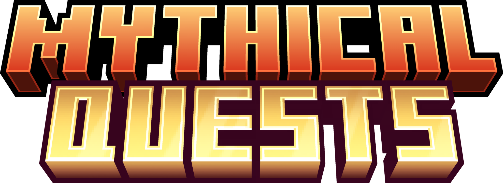
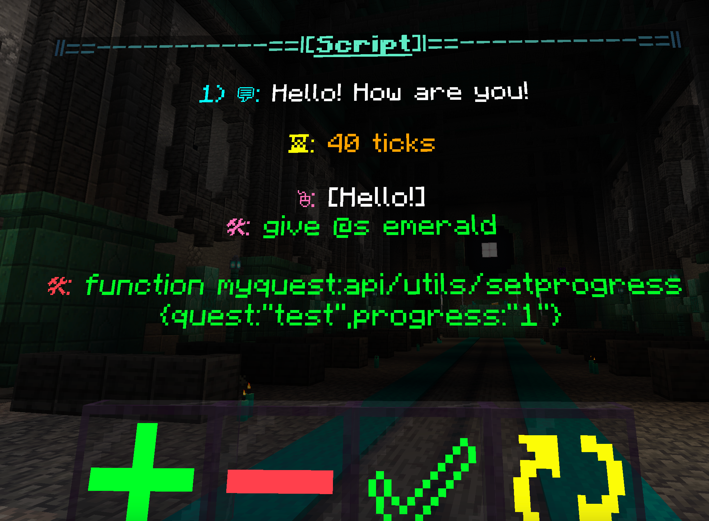

> [!important]
> This Datapack is made for Minecraft Version 1.20.2 upto 1.20.4

# Downloads

Download|Description
---|---
MythicalQuests_v2.0| All the features of the datapack.
MythicalQuests_v2.0_trimmed| Meant to be used after all content is created. Packs the bare minimum to make already made content function.
<br/>
<br/>
<br/>
<br/>

# Introduction
* A few general pointers to get you oriented with how the datapack organises stuff and introduction to terminology.
* The Details of how to actually use the pack will be mentioned later.
* Please make sure to read this before proceeding!
<br/>
<br/>
  
## Queststages

* Queststages are a part of a Quest that a single NPC has. Each Queststage is uniquely identified by a Queststage Name and a Quest Name.
* Queststages with the same Quest Name are considered part of the same Quest.
* A Queststage holds it's own name, the name of it's associated Quest, along with a Script.
* Additionally the Queststage can have requirements to trigger it (Progress in other Quests, or certain command checks) as well as a blacklist (Progress in other Quests, or certain command checks)
> [!warning]
> There can only be one Queststage with a given Quest and Queststage Name. If a Queststage sharing this is added, the previous one is overwritten.


<br/>
<br/>

## NPCs


>[!Important]
> * In this datapack, NPCs are actually interactions. The Visual Model for the NPCs needs to be set by you.
> * The Villager is the Visual Model. The visible name is also on the Villager.
* NPCs are interacted with via Right Clicking Them.
* NPCs hold Queststages.
>[!warning]
>Do not /kill NPCs. They have associated data that needs to be cleared to fully remove them. Use the Datapack Provided method for deleting NPCs.
<br/>
<br/>

## Quest Progress
* Quest Progress is an assignable stat for a Quest that can be awarded to a player.
* This is the recommended way to keep track of a player's progression.
* Quest Progress may or may not be awarded within a script, or externally.
* Quest Progress is also used to assign Objectives within the Questbook.
<br/>
<br/>
<br/>
<br/>

# Settings

* A few important settings to help customize Mythical Quests to your liking.
* They are stored on the scoreboard ``myquest.settings``
* Change them using:
  ```mcfunction
  scoreboard players set $<setting> myquest.settings <number>
  
  ##<number>
  #1 --> true
  #0 --> false
  ```


  ``<setting>``| Function| Default State
  ---|---|---
  $dialogueno|Adds numbering to NPC dialogue, showing current dialogue number and Total no. of Dialogues in the Script|True
  $spacer|Adds a line gap between NPC Dialogue automatically, making it more readable|True
  $fastforward|Skips Waiting times set between NPC Dialogue or other elements when NPC is Right Clicked Again|False
  
  <br/>
  <br/>
  <br/>
  <br/>

# Useful Commands
  ### Set a Player's Quest Progress in a Quest
   Run as the intended Player.
  ```mcfunction
  function myquest:api/utils/setprogress {quest:"<QUEST NAME>",progress:"<PROGRESS>"}
  ###Example
  #function myquest:api/utils/setprogress {quest:"Adventure Time",progress:"2"}
  ```

   ### Delete a Player's Quest Progress in a Quest
  Run as the intended Player.
  ```mcfunction
  function myquest:api/utils/deleteprogress {quest:"<QUEST NAME>"}
  ###Example
  #function myquest:api/utils/deleteprogress {quest:"Adventure Time"}
  ```

  ### Check a Player's Quest Progress in a Quest
  This is for external checking (Within other Datapacks/Command Blocks), within the pack there are better ways of checking Quest Progress. Run as the intended Player.
  ```mcfunction
  function myquest:api/utils/checkprogress {quest:"<QUEST NAME>",progress:"<PROGRESS>"}
  ###Example
  #function myquest:api/utils/checkprogress {quest:"Adventure Time",progress:"2"}
  # If Player has the appropriate progress, then
  ## $match on scoreboard myquest.zprivate will be = 1
  #
  ##Special Values
  #For Checking Progress, the value "any" will return true if any progress is present, besides progress "none"
  #Example
  #function myquest:api/utils/checkprogress {quest:"Adventure Time",progress:"any"}
  #This is will return true for ANY progress the player has within the Quest "Adventure Time" BESIDES "none"
  ```
  ### Change the Speaker in a Script
  Changes the displayed NPC name in dialogue, without any changes to the actual NPC. To be used within the Script
  ```mcfunction
  function myquest:api/utils/speaker {speaker:'<JSON TEXT>'}
  ##Example
  #function myquest:api/utils/speaker {speaker:'{"text":"John"}'}
  #This will change the speaker within the Script to John
  ```

  ### Force start a Queststage
  This ignores the Blacklist and Requirements of a Queststage, forcefully starting it. Run as the intended Player.
  ```mcfunction
  function myquest:api/utils/setprogress {quest:"<QUEST NAME>",progress:"<PROGRESS>"}
  ###Example
  #function myquest:api/utils/setprogress {quest:"Adventure Time",progress:"2"}
  ```

<br/>
<br/>
<br/>
<br/>

# Tools
* To get started using the pack, run the following command:
  ```mcfunction
  function myquest:api/tools
  ```
* You will get the Tools Item. This lets you access all the features of the pack.
  
  
  <br/>
  <br/>
  <br/>
  <br/>

# The Editor
  

* The Editor Lets you Generate Queststages and All components within it.
* To summon the Editor, Open the Tools book and click on ``[Summon Editor]``
* Look at the description of the Tools book. You can close the Editor using the instructions there.
>[!warning]
>If you close the Editor, you will lose all work within the closed editor.

>[!tip]
>You can summon multiple Editors.
<br/>
<br/>

  ## Buttons
  * The Editor has 4 buttons:

  Button|Function
  ---|---
  ``[+]``|Adds an element to the **bottom** of the list upon Right Clicking. Shift Right Click to open a more detailed menu to add/replace elements elsewhere.
  ``[-]``|Removes the **bottom-most** element of the list upon Right Clicking. Shift Right Click to open a more detailed menu to remove elements elsewhere.
  ``[✅]``| Generates the component of the Queststage in the form of an item, if everything necessary is present. When the Editor is in Script or Queststage mode, Right Click holding the tools book to Preview the Script or the Queststage (Matches Requirements and Blacklist for Queststage preview)
  ``[↻]``|Cycles between Editor modes. Sneak Right Click while holding Tools book to close editor.
  <br/>
  <br/>

  ## Script Mode
  >[!important]
  > This is a necessary component of a Queststage

  
  

  A Script can have 4 Types of Inputs:
  Input|Method of Input|Example
  ---|---|---
  Dialogue(💬)|Makes the NPC say something in chat. Type a tellraw command (with @p selector) into an **Impulse Command Block**, and Ctrl + Middle click to Grab it with NBT Data. Then add it to the ``[+]`` button on the Editor.|Command Block with command ``tellraw @p "Hello! How are you!"``
  Wait Time(⏳)|Waits the specified duration in ticks before continuing to read the Script. in a Book and Quil, write only a number, then add to the ``[+]`` button.|Book and Quil with ``40``on the first page
  Command(🛠)|Runs a command as the Player, at the Player. Type the Command in a **Chain Command Block** and add it to the ``[+]`` Button.|Chain Command Block with ``function myquest:api/utils/setprogress {quest:"test",progress:"1"}``
  Click Event(🖱️)|Generates a Clickable Text for the Player, which can be clicked. It may run commands on click if specified. Script reading stops when a Click Event is reached, and waits for a response. If Multiple Click Events are in a row in a Script, All of them are displayed before the Script stops and waits for a response. Method of Creation mentioned later in it's own secton|Click Event saying ``[Hello!]``, which runs the command ``give @s emerald``
  
  >[!warning]
  > When adding Commands to be run, do not add a ``/`` in front of them.
  <br/>
  <br/>

  ## Click Event Mode
  
  
  * Click Events are added within the Script.
  * The Player Can Click these in Chat to give a reply.
  * You can set commands to run when the Click Event is clicked.
  * A Click Event can have two Inputs:

  Input|Method of Input|Example
  ---|---|---
  Clickable Text(🖱️)|The text the Player is Supposed to click. Add in the same way as Dialogue in Script Mode.|Command Block with ``tellraw @p "[Hello!]"``
  Command(🛠)|Runs a list of commands in order when Click event is Clicked. Add in the same way as Command in Script Mode. You can add multiple commands.|Chain Command Block with ``give @s emerald``

  * After Adds the Appropriate elements to your Click Event, generate it into an item by clicking on the ``[✅]`` button. You can now add this item to the Script Mode ``[+]`` button to add it to a script.
  >[!tip]
  >Add Brackets such as ``[]`` to the Clickable Text, or give it a unique color to indicate to the Player that this text is clickable.
  <br/>
  <br/>

  ## Requirements Mode and Blacklist Mode
  >[!Note]
  > Optional, but recommended components for Queststages
  

  * If the Blacklist is met, Queststage does not trigger.
  * If the Requirements are not met, Queststage does not trigger.
  * There are two types of input in both Requirements and Blacklist:

  Input|Method of Input|Example
  ---|---|---
  Command|Runs a command as the Player, at The player and compares the result of the command to a value. Hold Chain Command Block with Command in mainhand and Book and Quil with value in     Offhand. Values can be ``x.. (x or greater)``, ``..x (x or lesser)`` or ``x..y (Between x and y, including x and y)``|Chain Command Block with ``clear @s dirt 0``, Book and Quil with        ``2..`` Will check if the player has at least 2 dirt.
  Quest Progress|Checks if the player has the specified Progress in the specified Quest. In a Book and Quil, write in the following format: ``quest:"QUEST NAME",progress:"PROGRESS"``|Book and Quil with ``quest:"test",progress:"1"``

  * After Making the Requirements and Blacklist in the Editor, grab them by clicking on the ``[✅]`` button.
  <br/>
  <br/>

  ## Queststage Mode
  >[!Important]
  >* A Queststage Must have a Script, Queststage Name and a Quest Name
  >* Queststages are grouped according to Quest Names in Menus, so be consistent.
  
  >[!WARNING]
  >There can only be one Queststage with a given Quest and Queststage Name. If a Queststage sharing this is added, the previous one is overwritten.
  
  
  The Queststage Mode has 4 types of inputs:

  Input|Method of Input|Example
  ---|---|---
  Script|Add the Script by holding it in your hand and pressing the ``[+]`` button.|The Script generated in the Script Mode Example.
  Requirements|Add the Requirements by holding it in your hand and pressing the ``[+]`` button.|The Requirements generated in the Requirements and Blacklist Mode Example.
  Blacklist|Add the Blacklist by holding it in your hand and pressing the ``[+]`` button.|The Blacklist generated in the Requirements and Blacklist Mode Example.
  Quest Name and Queststage Name|In a Book and Quil, write in the following format: ``quest:"QUEST NAME",queststage:"QUESTSTAGE NAME"``|A Book and Quil with ``quest:"test",queststage:"1"``
  
  
 
  
  


